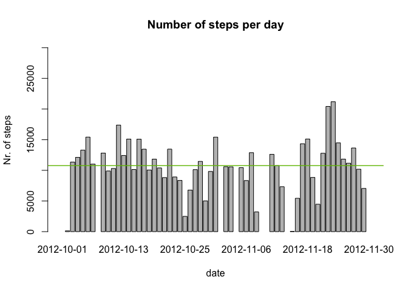
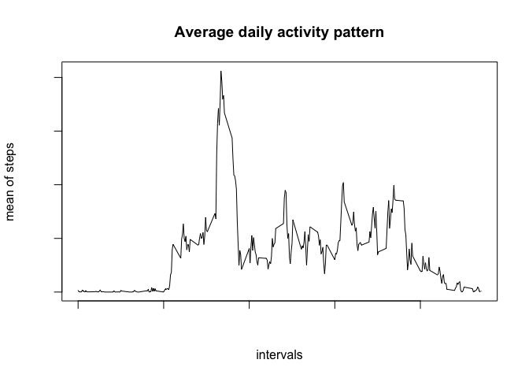
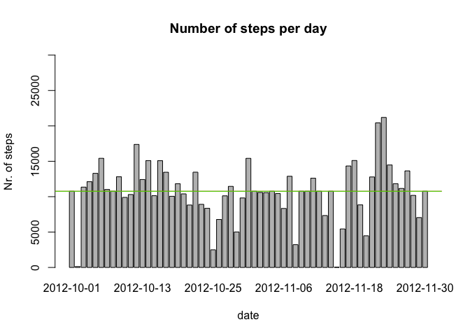
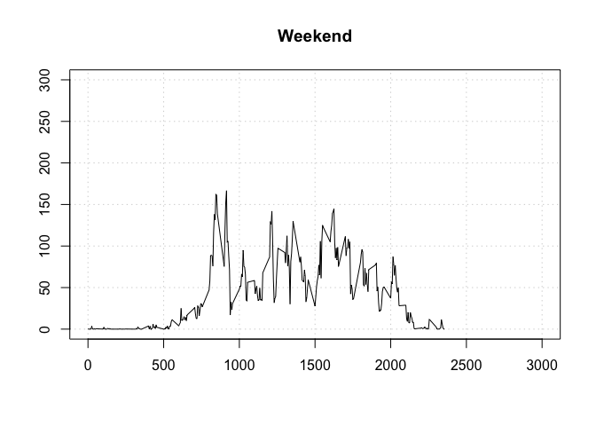
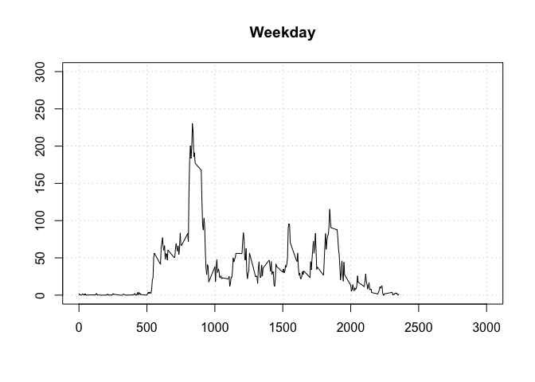

# Reproducible Research: Peer Assessment 1


## Loading and preprocessing the data
1. Download the dataset and save it to local "data" folder

url <- "http://d396qusza40orc.cloudfront.net/repdata%2Fdata%2Factivity.zip" <br/>
download.file(url, method="internal", destfile="data/activity.zip") <br/>
unzip("data/activity.zip", exdir="data")


```r
datafile <- read.csv("data/activity.csv")
head(datafile)
```

```
##   steps       date interval
## 1    NA 2012-10-01        0
## 2    NA 2012-10-01        5
## 3    NA 2012-10-01       10
## 4    NA 2012-10-01       15
## 5    NA 2012-10-01       20
## 6    NA 2012-10-01       25
```

## What is mean total number of steps taken per day?
1. Calculate the total number of steps taken per day


```r
dailysteps <- aggregate(datafile$steps, by = list(datafile$date), sum)
colnames(dailysteps) <- c("date","sum")
head(dailysteps)
```

```
##         date   sum
## 1 2012-10-01    NA
## 2 2012-10-02   126
## 3 2012-10-03 11352
## 4 2012-10-04 12116
## 5 2012-10-05 13294
## 6 2012-10-06 15420
```

2. Calculate the mean and median, while the missing values are ignored.


```r
mean_dailysteps <- mean(dailysteps$sum, na.rm = T)
```

```
## [1] "mean =  10766.1886792453"
```


```r
median_dailysteps <- median(dailysteps$sum, na.rm = T)
```


```
## [1] "median =  10765"
```

3. Make the plot to illustrate the number of steps taken per day.

```r
with(dailysteps, {    
  barplot(height=sum, names.arg=date, xlab="date", ylim=c(0,30000),
    ylab="Nr. of steps", main = "Number of steps per day")
})

abline(h=mean_dailysteps, UNTF = FALSE, col="red")
```

```
## Warning in int_abline(a = a, b = b, h = h, v = v, untf = untf, ...): "UNTF"
## is not a graphical parameter
```

```r
abline(h=median_dailysteps, col="green")
```

 


## What is the average daily activity pattern?
1. We construct a time series plot (i.e. type = "l") of the 5-minute interval (x-axis) and the average number of steps taken, averaged across all days (y-axis)


```r
interval_steps <- aggregate(steps ~ interval, data = datafile, FUN = mean)
head(interval_steps)
```

```
##   interval     steps
## 1        0 1.7169811
## 2        5 0.3396226
## 3       10 0.1320755
## 4       15 0.1509434
## 5       20 0.0754717
## 6       25 2.0943396
```


```r
with(interval_steps, {
  plot(interval, steps, type="l", xlab="intervals", ylab="mean of steps", 
       main="Average daily activity pattern", 
       col.axis="white")
})
```

 

2. Which 5-minute interval, on average across all the days in the dataset, contains the maximum number of steps?


```r
max_daily_steps <- interval_steps$interval[which.max(interval_steps$steps)]
```


```
## [1] "Maximum number of steps per day = 835"
```

## Imputing missing values

1. Calculate the total number of missing values in the dataset (i.e. the total number of rows with NA's)


```r
total_missing_values <- sum(is.na(datafile))
```


```
## [1] "Total missing values in the file = 2304"
```


2. Devise a strategy for filling in all of the missing values in the dataset. The strategy does not need to be sophisticated. For example, you could use the mean/median for that day, or the mean for that 5-minute interval, etc.


```r
filled_na <- aggregate(steps ~ interval, datafile, mean, na.action = na.omit)$steps
```


3. Create a new dataset that is equal to the original dataset but with the missing data filled in.


```r
# create a new column of steps from the original one
datafile$steps_2 <- datafile$steps
nr_obs <- nrow(datafile)
i <- 1
while(i <= nr_obs) {
  if( is.na(datafile$steps[i]) ) {
		interval_row <- datafile$interval[i]
		datafile$steps_2[i] = interval_steps$steps[which(interval_steps$interval==interval_row)]
	}	
	i <- i + 1
}
head(datafile)
```

```
##   steps       date interval   steps_2
## 1    NA 2012-10-01        0 1.7169811
## 2    NA 2012-10-01        5 0.3396226
## 3    NA 2012-10-01       10 0.1320755
## 4    NA 2012-10-01       15 0.1509434
## 5    NA 2012-10-01       20 0.0754717
## 6    NA 2012-10-01       25 2.0943396
```


4. Make a histogram of the total number of steps taken each day and Calculate and report the mean and median total number of steps taken per day. Do these values differ from the estimates from the first part of the assignment? What is the impact of imputing missing data on the estimates of the total daily number of steps?


```r
steps_per_day_new <- aggregate(datafile$steps_2, by=list(date = datafile$date), sum)
colnames(steps_per_day_new) <- c("date","sum")
mean_new_data <- mean(steps_per_day_new$sum)
median_new_data <- median(steps_per_day_new$sum)
```


```
## [1] "mean =  10766.1886792453"
```


```
## [1] "median =  10765"
```


```r
with(steps_per_day_new, {
  barplot(height=sum, names.arg=date, xlab="date", ylim=c(0,30000),
    ylab="Nr. of steps", main = "Number of steps per day")
})
abline(h=mean_new_data, col="red")
abline(h=median_new_data, col="green")
```

 


Both old and new mean data show the same value, while the median is slightly different. (old: 10765 , new: 10766.19)

## Are there differences in activity patterns between weekdays and weekends?


```r
list_week <- c("Weekend", "Weekday")

day_of_week <- function(date_value) {
    d <- as.POSIXlt(as.Date(date_value))$wday
    return( ifelse(d == 0 || d == 6, list_week[1], list_week[2]))
}

datafile$week_type <- as.factor(sapply(datafile$date, day_of_week))
head(datafile)
```

```
##   steps       date interval   steps_2 week_type
## 1    NA 2012-10-01        0 1.7169811   Weekday
## 2    NA 2012-10-01        5 0.3396226   Weekday
## 3    NA 2012-10-01       10 0.1320755   Weekday
## 4    NA 2012-10-01       15 0.1509434   Weekday
## 5    NA 2012-10-01       20 0.0754717   Weekday
## 6    NA 2012-10-01       25 2.0943396   Weekday
```


```r
for(i in list_week) {
    steps_per_weektype <- aggregate(steps_2 ~ interval, data = datafile, subset = (datafile$week_type == i), FUN = mean)
    plot(steps_per_weektype, type = "l", main = i, xlab="", ylab="", ylim=c(0,300), xlim=c(0,3000), 
    panel.first=grid())
}
```

  
